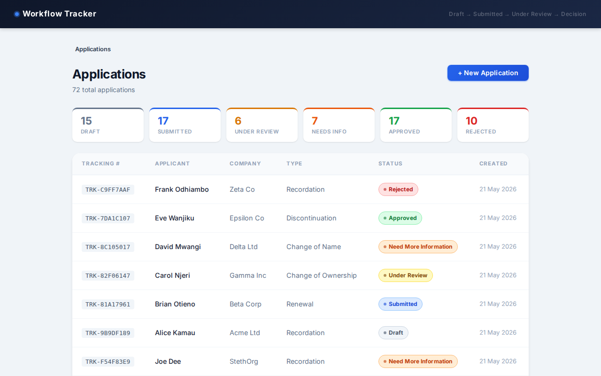
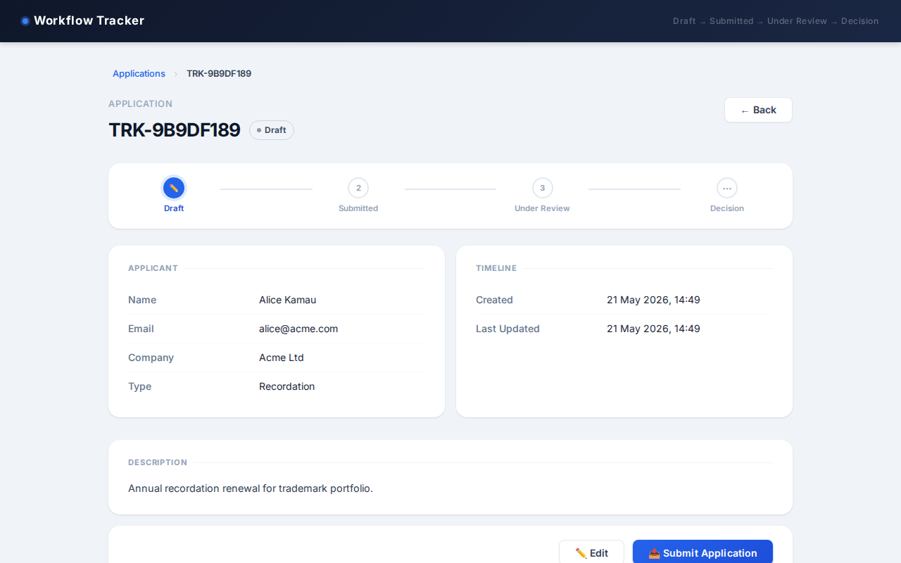
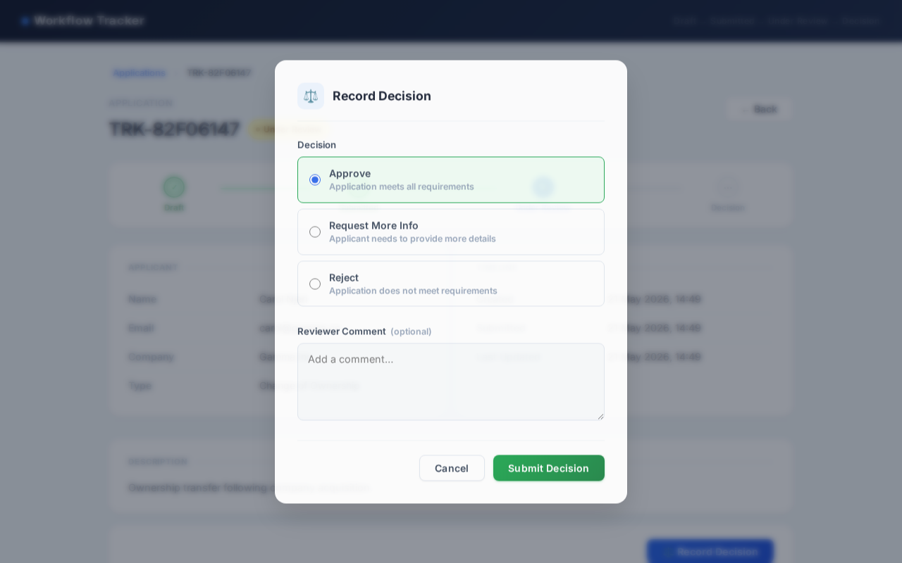
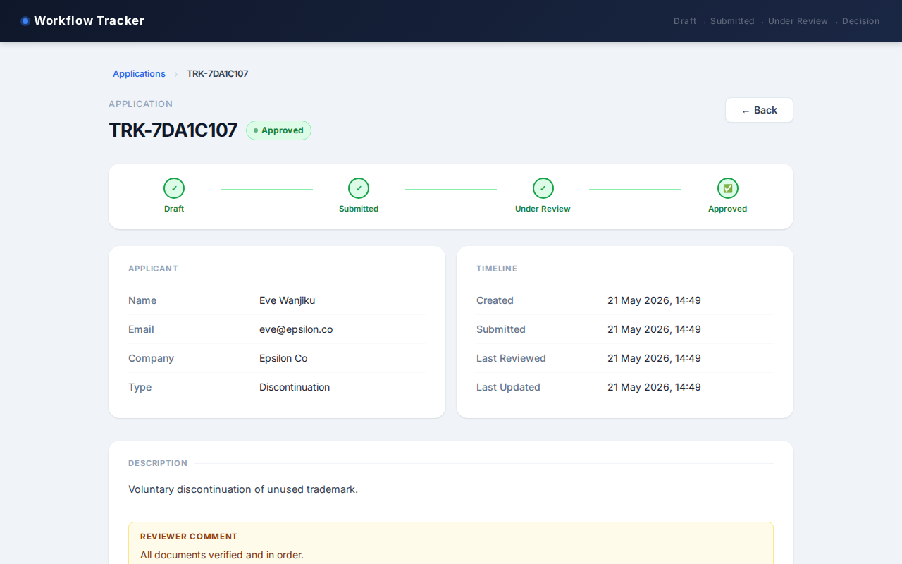

# Workflow Tracker

A mini application workflow tracker built with **Django + Django Ninja** (backend REST API) and **React + Vite** (frontend).

## Screenshots

| Application List | Application Detail |
|---|---|
|  |  |

| Reviewer Decision Modal | Approved Application |
|---|---|
|  |  |

> All screens: [screenshots/](screenshots/)

---

## Workflow

```
Draft → Submitted → Under Review → Approved
                                 → Need More Information → (edit & resubmit) → Under Review
                                 → Rejected
```

---

## Prerequisites

| Tool | Minimum version |
|------|----------------|
| Python | 3.10+ |
| Node.js | 18+ |
| npm | 8+ |

---

## How to Run the Backend

```bash
# 1. Move into the backend directory
cd backend

# 2. Create and activate a virtual environment
python3 -m venv venv
source venv/bin/activate          # Windows: venv\Scripts\activate

# 3. Install Python dependencies
pip install -r requirements.txt

# 4. Apply database migrations  ← see dedicated section below
python manage.py migrate

# 5. Start the development server
python manage.py runserver
```

The API will be available at **http://localhost:8000/api/**

Interactive Swagger docs (auto-generated by Django Ninja): **http://localhost:8000/api/docs**

> If you see `Error: That port is already in use`, the server is already running. You can kill it with `pkill -f "manage.py runserver"` and restart.

---

## How to Run the Frontend

Open a **second terminal** (keep the backend running in the first):

```bash
# 1. Move into the frontend directory
cd frontend

# 2. Install Node dependencies (only needed once)
npm install

# 3. Start the Vite development server
npm run dev
```

The app will be available at **http://localhost:5173**

> If port 5173 is already taken, Vite will use 5174. If the app shows "Failed to fetch", check which port Vite is using and open that URL instead.

---

## How to Run Migrations

Migrations are managed by Django and must be applied before the backend can serve any data.

```bash
cd backend
source venv/bin/activate

# Apply all pending migrations (creates the database tables)
python manage.py migrate

# If you change models.py, first generate a new migration file then apply it
python manage.py makemigrations
python manage.py migrate
```

The project uses **SQLite** by default. The database file (`db.sqlite3`) is created automatically inside the `backend/` directory on first run — no database server setup required.

---

## API Endpoints

| Method | Endpoint | Description |
|--------|----------|-------------|
| `POST` | `/api/applications/` | Create a new draft application |
| `GET` | `/api/applications/` | List all applications |
| `GET` | `/api/applications/{id}` | View application details |
| `PUT` | `/api/applications/{id}` | Update a draft application |
| `POST` | `/api/applications/{id}/submit` | Submit a draft for review |
| `POST` | `/api/applications/{id}/review` | Move a submitted application to Under Review |
| `POST` | `/api/applications/{id}/decide` | Record a reviewer decision (Approve / NMI / Reject) |

Full interactive documentation with request/response schemas is available at `http://localhost:8000/api/docs` when the backend is running.

---

## Assumptions

- **No authentication.** There are no user accounts or login screens. Applicant actions (create, submit) and reviewer actions (start review, decide) are all accessible to anyone. In a real system these would be separated by role.
- **SQLite for storage.** The database is a local file — zero configuration needed for development. It is not suitable for production use.
- **Auto-generated tracking numbers.** Each application is assigned a unique identifier in the format `TRK-XXXXXXXX` (8 random hex characters) at creation time. These are read-only after creation.
- **Need More Information re-enters the queue.** When an application receives a "Need More Information" decision, the applicant edits it and resubmits. This moves the status back to `Submitted`, and a reviewer must start the review again before recording a new decision.
- **Reviewer comment is optional for Approved.** A comment is required when the decision is "Need More Information" or "Rejected", but optional when approving.
- **Single-page app routing.** The frontend uses React Router with client-side routing. Navigating directly to a URL (e.g. `/applications/5`) requires the Vite dev server to be running.

---

## What I Would Improve With More Time

- **Authentication & role separation.** Add JWT-based login with distinct Applicant and Reviewer roles, so only reviewers can start reviews and record decisions.
- **Pagination & search.** The list endpoint currently returns all records. A real deployment would need server-side pagination, status filtering, and full-text search by applicant name or tracking number.
- **PostgreSQL in production.** Replace SQLite with PostgreSQL and add a `docker-compose.yml` so the full stack (API + DB) can be spun up with a single command.
- **Unit & integration tests.** Add pytest tests covering every workflow transition rule on the backend, and React Testing Library tests for the status-based action logic on the frontend.
- **Email notifications.** Send an email to the applicant when their application is submitted, approved, rejected, or returned for more information.
- **File attachments.** Allow applicants to upload supporting documents (e.g. PDFs) alongside the application description.
- **Audit trail.** Log every status transition with a timestamp and the acting user so reviewers can see the full history of an application.
- **Mobile responsiveness.** The table layout on the list screen does not adapt well to small screens. A card-based layout would work better on mobile.
